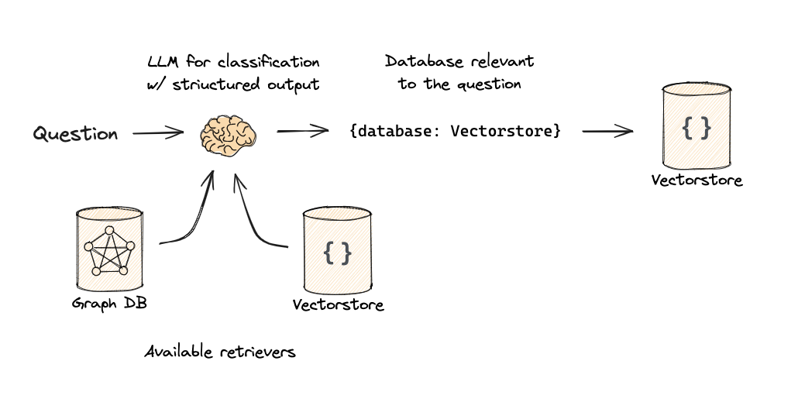

# Overview

TODO: Write a project description

TODO: Add a table of contents

TODO: RAG GRAPH from langchain or MS presentation


## Code Generation
Context of LLM prompt is limited and it is important to provide the right context to the model. Fore code suggestions, we should define what data should we include in the prompt, how to rank its relevancy. In common development experience we can define the following data sources that can be used to define the context

### Operational Context
  - current file, language, project, folder
  - state of repository, i.e. modified files, git diff, branch, etc.
  - current cursor position, i.e. function, class, variable, whether completion is multi- or singleline, should we consider FIM (fill-in-the-middle) etc.
  - current selection, i.e. selected text, line, block, etc.
  - current cursor surroundings, i.e. previous and next lines (contextual comments can be important for search purposes), etc.
  - state of editor, i.e. open files, tabs, recent edits, clipboard content etc.
  - Abstract Syntax Tree (AST) for current file

### Environment Context
  - files in repository, preferrably related to current context
  - external repositories, i.e. dependencies, libraries, etc.
  - AST for current context, i.e. current file, related files, current solution, project, etc.
  - code guidelines and practices for current context (language, project, team), i.e. code style, libraries, etc.
  - code analysis configuration, i.e. linters, static analyzers, formatters, etc.
  - documentation for current context, i.e. external (web) or internal documentation and resources, etc.

### Task Context
  - data for current task in task management system, i.e. task description, NFRs, etc.
  - data in repository for current task or related tasks, i.e. comments, PRs, etc.
  - data in external repositories for current task or related tasks

### User Context
  - user style, preferred libraries, etc.
  - files edited by user in current and external repositories
  - user role, i.e. developer, tester, etc.

### Limitations
  - privacy and security concerns, i.e. should we include sensitive data in the prompt
  - current LLM and RAG settings, i.e. model limits, api capabilities, parameters like temperature, etc.
  - performance, i.e. how whole system is able to handle the context

## Existing Solutions
AI Assistance tools and code generation products are promising to improve the development experience. Some of the most popular tools are

### Github Copilot
Github Copilot is most popular AI assistant for code generation. It supports most of the popular IDEs and code editors and provides following features

  - **Code Assistant** - provides code suggestions, chat with code gen capabilities, doc generations and more
  - **Repository indexing** - GitHub allows to index the repositories and provide the better context for the code generation
  - **Fine Tuning** - allows to fine tune the model for specific tasks and code generation
  - **Knowledge bases** - you can fine-tune Copilot code completion by creating a custom model based on code in your organization's repositories
  - **Copilot Workspace** - task-oriented development environment, instead of making suggestions as you type, it helps you plan and author a coordinated set of changes, so that you can steer the system via natural language

### Cursor
Cursor is a code editor built for programming with AI. It is run on VSCode wngine but no offered as a plugin. It provides following features

  - **Code Assistant** - includes a powerful autocomplete that predicts thr next edit, can suggest multiple edits at once
  - **Chat** - allwos to use *codebase*, *libraries*, *documentation* and *images* to find relevant code or answer to the query
  - **Cursor Prediction** - Cursor allows to index the repositories and provide the better context for the code generation
  - **Customization** - allows to select LLM model for the code assistance

### Continue.Dev
The leading open-source AI code assistant, it provides highly customizable environment, offered as plugin for VScode and JetBrains IDE with following features

  - **Code Assistant** - provides code suggestions, chat with code gen capabilities, AI code edit capabilities
  - **Custom models** - allows to set up custom models for different features with simple configuration
  - **Custom Context** - allows to augment the context with custom data sources, codebase, web resources, IDE state, Issue tracking services, Code search, etc. (https://docs.continue.dev/customize/context-providers)

## AI Dev Tools
In order to model, evaluate, build and run Code Generation and Context Augmentation workloads we can use tools provided by the following vendors

### LLamaIndex
LlamaIndex is a framework for building context-augmented generative AI applications with LLMs including agents and workflows. It provides **Python** libraries, tools and APIs for buiding data-backed LLM applications

https://docs.llamaindex.ai/en/stable/getting_started/concepts/


### LangChain
LangChain is a platform for building AI-powered applications with LLMs. It provides flexible API and toolkit that contains **Python** and **JavaScript** libraries for building AI applications and contains complete set of RAG building blocks

https://python.langchain.com/docs/concepts


### Semantic Kernel
Semantic Kernel is a lightweight, open-source development kit that lets you easily build AI agents and integrate the latest AI models into your **C#**, **Python**, or **Java** codebase

https://learn.microsoft.com/en-us/semantic-kernel/concepts/kernel


## Data Ingestion


### Loading documents

Document is piece of information available for indexing. It can be a text, image, video, audio, etc. Document effectively consists of two parts: *content* and *metadata*. Metadata is a set of key-value pairs that describe the content.

In order to load document to vector store, it should fit the size for similarity search in a way that it contain meaningful information (that is highly dependent on the document nature) and resonable size. Too fine-grained might lead to noisy retrieval, and too coarse might limit usefulness.

### Chunking

Chunk is the unit of storage that will be retreived fron Vecrtor Store. It will have it's embedding vector and metadata of the whole document, it solves 3 problems 

 - Splitting long documents into limited-length passages allows multiple retrieved documents to be passed to the LLM within its context window limit.
 - Chunking provides a mechanism for the most relevant passages of a given document to be ranked first.
 - Vector search has a per-model limit to how much content can be embedded into each vector.

Chunking Strategies 
  - **Fixed Size** - evaluate the best token length, i.e. 512 tokens, 1024 tokens, etc. up to the model embedding limit
  - **Overlapping** - allows to include the same information in multiple chunks, i.e. 10% overlaping between chunks
  - **Interquartile** - split documents into chunks based on the interquartile range (e.g., lower 25%, middle 50%, upper 25%)
  - **Document Based** - split by meaningful parts based on document nature
      - Split code by functions, classes, etc.;and text by paragraphs, sentences, etc.
      - Split Markdown by headers, lists, etc.
      - Keep tables within the same chunk
      - Preserve sentence or paragraph boundaries
  - **Semantic** - group the content by semantic meaning, i.e. split by topics, entities, etc.

Here are some examples of chunking strategies and their performance:

| Chunk Strategy | Recall@50 |
|----------------|-----------|
|512 tokens, break at token boundary|40.9|
|512 tokens, preserve sentence boundaries|42.4|
|512 tokens, with 10% overlapping chunks|43.1|
|512 tokens, with 25% overlapping chunks|43.9|


## Embeddings
Text embeddings measure the relatedness of text strings. Embeddings are commonly used for:

  - Search (where results are ranked by relevance to a query string)
  - Clustering (where text strings are grouped by similarity)
  - Recommendations (where items with related text strings are recommended)
  - Anomaly detection (where outliers with little relatedness are identified)
  - Diversity measurement (where similarity distributions are analyzed)
  - Classification (where text strings are classified by their most similar label)

An embedding is a vector of floating point numbers. The *distance* between two vectors measures their relatedness. Small distances suggest high relatedness and large distances suggest low relatedness.


LLM vendors provide a variaty of embedding models for different purposes that differ in vector dimension size and context window size. The total parameter size can be calculates as a product of vector dimension and number of words (tokens) in the model. Some models are sprecifically designed for embeddings, some of them provide embeddings along with generation capabilities. Here are some of the most popular models

  - **OpenAI** - 2nd and 3rd generation models with dimension size of 1536 and 3072, 8191 context size (https://platform.openai.com/docs/guides/embeddings/embedding-models)
  - **Sentence Transformers (a.k.a SBERT)** - state-of-the-art text and image embedding models, applicable for a wide range of tasks, such as *semantic textual similarity*, semantic search, clustering, classification, paraphrase mining, and more. It features  768 dimensions and 512 tokens context size (https://sbert.net/)
  - **Cohere** - provides separate embedding model for english and multilingual text with up to 1024 dimensions and 512 tokens context size (https://docs.cohere.com/docs/models#embed)
  - **Llama 3.1** - new state-of-the-art model from Meta available in 8B, 70B and 405B parameter sizes. Featues dimension size up to 16K and context length up to 130K (https://ollama.com/library/llama3.1)
  - **Codellama** - LLM that can use text prompts to generate and discuss code. Features 768 dimensions and 512 tokens context size (https://ollama.com/library/codellama)
  - **Starcoder** - 15.5B parameter models trained on 80+ programming languages and  GitHub code, it features upto 6K dimension size and a context window of up to 16K tokens
  - **Stability.ai** - provides a wide range of models for different purposes, i.e. code generation (*Stable Code*), text generation, etc. (https://stability.ai/stable-lm)
  - **Voyage AI** - embedding model that is offered by *Anthropic*, provides state-of-the-art embedding models and offers customized models for specific industry domains such as finance and healthcare. Its family has models with up to 1536 dimensions and 16K context size with purpose of text and code retreival (https://docs.anthropic.com/en/docs/build-with-claude/embeddings)


  Models are provided in different ways, some of them are available as API services, some are available as local libraries. Here are some of the most popular services
  - **OpenAI** - provides API for embedding text into vector representation with OpenAI model provided
  - **Cohere** - provides API for embedding text into vector representation with Cohere model and *embeddings purpose* provided. It also features *Classification* endpoint that allows to classify the text based on examples given and embedding model
  - **Ollama** - is an open-source project that serves as a for running LLMs on your local machine, it provides possibility to pull a variaty of models (https://ollama.com/library), for example
    - all-minilm - Sentence Transformers (a.k.a SBERT) 
    - llama family
    - mistral
    - starcoder
    - qwen family
  - **Hugging Face** - a platform where models from different organizations are hosted and provided via API. A wide range of models are available https://huggingface.co/models 
  - **Anthropic** - provides API for embedding text into vector representation with *Voyage AI* model provided (it includes domain specific *voyage-law*, *voyage-healthcare* models). *Voyage AI* in turn, also provides embedding API with other embedding models capabilities

### Advanced Indexing Strategies 

<br>


<br>

In order to improve quality of the search results, we can use advanced indexing strategies that will allow to provide more relevant data in a more reliable way.

  - Text Indexing - create text indexes to improve relevance of results by utilizing keyword search
  - Multi-Representation indexing - convert documents into compact retreival units 
  (e.g. summarize large text, table data, image descriptions provided by LLM) to embed into vector index while keeping reference to raw data
  - Multi-Model indexing - use multiple models to index the data, i.e. use SBERT for text, Codellama for code, etc.
  - Metadata Extraction - extract metadata from the documents and use it for filtering and ranking
  - Named Entity Recognition - extract named entities from the documents and set up relations between them for better understanding of data
  - Document Intelligence - preprocess data with AI (e.g. table detection, html removal, etc.)  

## Data Retrieval

### Vector Search
The task of a vector search is to identify and retrieve a list of vectors (embeddings) that are closest to the given vector (embedding of your query), using a distance metric and a search algorithm.

**Symmetric vs Asymmetric Search**<br>
For **symmetric semantic search** your query and the entries in your corpus are of about the same length and have the same amount of content. An example would be searching for similar questions.
For **asymmetric semantic search**, you usually have a short query (like a question or some keywords) and you want to find a longer paragraph answering the query.

It is critical that you choose the right model for your type of task.

**Search Algorithms**<br>
Despite of the model used, there are several search algorithms that differ in performance, precision and other properties.

*k-Nearest Neighbors*<br>
This brute force algorithm that is comparing every data vector in the database to the query vector. It is the most precise but also the most computationally expensive.

*Approximate Nearest Neighbors*<br>
This algorithm is using inner structures to reduce the number of comparisons. It is less precise but much faster than k-NN. However, the results are not necessarily exact, it is possible that some vectors with high similarity will be missed. Here is example of how data can be partitioned for faster search.


For all ANN methods, there are usually one or more parameters to tune that determine the recall-speed trade-off. If you want the highest speed, you have a high chance of missing hits. If you want high recall, the search speed decreases. For example for **HNSW** (Hierarchical Navigable Small World) they are  *efSearch* (the number of neighbors to search for) and M (the number of edges to add to every new node during insertion). 


  - SVM (Support Vector Machine)


Depending on the model used, vectors can have thousands of dimensions, some similarity measures are more compute-heavy than others. For that reason, we have different distance metrics that balance the speed and accuracy of calculating distances between vectors.


  - **Cosine Similarity** - measures the angle between two vectors, the cosine distance is `1 - Cosine Similarity`, a distance of 0 indicates that the vectors are identical, whereas a distance of 2 represents opposite vectors (it is mostly used in text search)
  - **Dot Product** - dot product takes two or more vectors and multiplies them together, it is negative if the vectors are oriented in different directions and positive if the vectors are oriented in the same direction.
  - **Squared Euclidean** - measures the straight-line distance between two vectors. If the distance is zero, the vectors are identical, the larger the distance, the farther apart the vectors are.
  - **Manhattan** - measure is calculated by summing the absolute distance between the components of the two vectors

### Full-Text Search
Despite of vector search based on embeddings is providing quite accurate results, for some queries and contexts full-text keyword search can bring better performance and significantly contributes to contextual understanding.

Full-Text (lexical) search generic concept is to tokenize the corpus and the query, then search for the tokens in corpus. The search can be done using different algorithms and data structures, some of the most popular are

  - **TF-IDF (Term Frequency-Inverse Document Frequency)** - is a statistical measure that evaluates how important a word is to the corpus. It can also be used to rank the relevance of documents, recieved in RAG workflow, to a query.
  - **BM25 (Best Matching 25)** - is a ranking function used by search engines to rank the relevance of documents to a query. It is an improvement over TF-IDF and is used in search engines like ElasticSearch and Solr.
  - **Inverted Index** - is a data structure that maps content to its location in a document. It is used to optimize full-text search, where the search term is matched against the index instead of the whole corpus. It is used in most search engines, including ElasticSearch, Solr, and others.

To effectively use full-text search capabilities you can consider some popular search engines and services like **ElasticSearch** and **Solr** along with cloud-based services like **Algolia**, **Azure AI Search**, **AWS CloudSearch**, and **Google Cloud Search**.

### Filtering
Filtering can bring significant improvement to the search results. It can be done based on the context of the query with the following strategies

**Metadata Filtering**<br>
Construct queries to leverage metadata provided for the documents in the vector store. Metadata can be used to filter the documents before the search is performed.

**Query Analysis and Self-Querying**<br>
The filter for documets metadata can be defined based on the context and can involve LLM capabilities to specify certain fields or values that should be present in the document.


**Routing**<br>
Based of the contextual knowlegde, you can route the query to the specific vector store or search engine that is most relevant to the query. For these purposes you can use heuristics, strict logic models or even LLM



### Hybrid Search
The approach that combines both vector search and full-text search usually referenced as **Hybrid Search** and allows to leverage the power of both approaches.
| Feature                    | Full-text search | Pure Vector search | Hybrid search |
|----------------------------|------------------|--------------------|---------------|
| Exact keyword match         | ✅                | ❌                  | ✅             |
| Proximity search            | ✅                | ❌                  | ✅             |
| Term weighting              | ✅                | ❌                  | ✅             |
| Semantic similarity search  | ❌                | ✅                  | ✅             |
| Multi-modal search          | ❌                | ✅                  | ✅             |
| Multi-lingual search        | 🟡                | ✅                  | ✅             |

- **✅** feature is supported.
- **❌** feature is not supported.
- **🟡** partial or limited support (in the case of multi-lingual search for full-text search).

### Re-Ranking
When multiple sources are used for data retrieval, it is important to re-rank the results to provide the most relevant data to the user. Re-ranking can be done based on the following strategies

  - **Vector weighting** - when reranking results, we can set the importance of each resultset by setting the weight multiplier for each searh  score.
  - **MMR (Maximum marginal relevance)** - is a re-ranking algorithm that aims to reduce redundancy in search results by selecting the most relevant and diverse documents.
  - **RRF (Relevance Ranking Fusion)** - the algorithm that allows to assign a reciprocal rank score to each document received in search results from multiple methods. It combines the scores to create a new ranking. The concept is that documents appearing in the top positions across multiple search methods are likely to be more relevant and should be ranked higher in the combined result.
  - **Semantic Re-Ranking** - is a re-ranking algorithm that uses semantic similarity to update relevance score of search results.
    - **Cross-Encoding (x-enc)** - cross-encoder concatenates text pairs (query and doc) into a single sequence (e.g., [CLS] Text1 [SEP] Text2 [SEP]) and fed into the transformer model, the model processes the entire concatenated sequence and produces a single output (usually from the [CLS] token or a classification head), which represents the similarity or relevance between texts ([example](https://cookbook.openai.com/examples/search_reranking_with_cross-encoders)).
    - **ColBERT (Contextualized Late Interaction over BERT)** - uses a late interaction mechanism, where the token-level embeddings of queries and documents are computed separately. These embeddings are then compared using a MaxSim operation during retrieval, which takes the maximum similarity between each query token and all document tokens.
    - **Cohere** and **Voyage AI** - is a re-ranking API services that allows to re-rank documents with help of specifically trained `rerank-*` models (https://docs.cohere.com/docs/rerank-2, https://docs.voyageai.com/docs/reranker)

Re-Ranking significantly improves the quality of the search results.
|                           | Acc @1 | Acc @3 | R @3 | CNS @1 |
|---------------------------|--------|--------|-------|--------|
| Vector search (baseline)   | 0.63   | 0.87   | 0.81  | 0.71   |
| w/ Re-ranker x-enc         | **0.88**   | **0.99**   | 0.77  | **0.85**   |
| w/ Metadata                | 0.66   | 0.92   | **1.00**  | 0.76   |
| w/ Metadata and x-enc      | **0.89**   | **1.00**   | **1.00**  | **0.89**   |

- Acc @1 - Accuracy at 1
- Acc @3 - Accuracy at 3
- R @3 - Recall at 3
- CNS @1 - Consistency at 1

The final schem of data retrieval that will significantly improve the quality of the search results and context understanding is shown below

<p align="center">
  
</p>

### Vector Stores
https://docs.llamaindex.ai/en/stable/module_guides/storing/vector_stores/
https://python.langchain.com/docs/integrations/vectorstores/

Vectore store capabilities
  - Storage type (in-memory, self-hosted, cloud)
  - Filtering (stores can support metadaa filtering)
  - Vector Similarity search
  - Text search
  - Hybrid search
  - Vector Store specific search

Some common vector stores
  - Faiss (Facebook AI Similarity Search)
  - Pinecone
  - ElasticSearch
  - pgvector (Postgres)
  - Altas Search (MongoDB)
  - Azure AI Search / NoSQL DB (with semantic reranking)
  - Qdrant
  - Chroma


## LLMs

### API based
  - OpenAI (GPT-*)
  - Anthropic (Claude)
  - Google (Gemini)
  - Cohere
  - HuggingFace
  - Cloud services (Azure Open AI, Amazon Bedrock)

### Local
  - Ollama
  - LlamaCpp (CPU optimized)

### Special purpose
  - **Starcoder** - Model is intended for code completion, they are not instruction models, commands like "Write a function that computes the square root." do not work well. Model natively supports Fill-in-the-middle prompts and can be fine-tuned for specific tasks(https://huggingface.co/bigcode/starcoder)

Code

## Evaluation

Metrics
  - RGB
  - RECALL

### Langchain

https://autoevaluator.langchain.com/

### Ragas
Retrieval Augmented Generation
  - Context Precision
  - Context Recall
  - Context Entities Recall
  - Noise Sensitivity
  - Response Relevancy
  - Faithfulness

### ARES

### OpenAI Evals

### RaLLe

https://github.com/yhoshi3/RaLLe

## Advanced RAG

  - GraphRAG
  - MMR (Maximal Marginal Relevance)
  - Self query and query reformulation 
  - Preprocess data with AI (e.g. document intelligence, metadata extraction, table detection, etc.)

## Start

```
pip install -r requirements.txt
```

### Limitations


