Retrieval-Augmented Generation
=================
  
  * [RAG Overview](#rag-overview)
  * [(Code) Generation](#code-generation)
    * [Operational Context](#operational-context)
    * [Environment Context](#environment-context)
    * [Task Context](#task-context)
    * [User Context](#user-context)
    * [Limitations](#limitations)
  * [Existing Solutions](#existing-solutions)
    * [Github Copilot](#github-copilot)
    * [Cursor](#cursor)
    * [Continue.Dev](#continuedev)
  * [AI Dev Tools](#ai-dev-tools)
    * [LLamaIndex](#llamaindex)
    * [LangChain](#langchain)
    * [Semantic Kernel](#semantic-kernel)
  * [Data Ingestion](#data-ingestion)
    * [Loading documents](#loading-documents)
    * [Chunking](#chunking)
    * [Embeddings](#embeddings)
    * [Advanced Indexing Strategies](#advanced-indexing-strategies)
  * [Data Retrieval](#data-retrieval)
    * [Vector Search](#vector-search)
    * [Full-Text Search](#full-text-search)
    * [Hybrid Search](#hybrid-search)
    * [Advanced Search Strategies](#advanced-search-strategies)
    * [Vector Stores](#vector-stores)
  * [LLMs](#llms)
    * [API based](#api-based)
    * [Local](#local)
    * [Special purpose](#special-purpose)
  * [Evaluation](#evaluation)
    * [Langchain](#langchain-1)
    * [Ragas](#ragas)
    * [ARES](#ares)
    * [OpenAI Evals](#openai-evals)
    * [RaLLe](#ralle)
  * [Graph RAG](#graph-rag)
  * [Explore Python Workbook](#explore-python-workbook)

# RAG Overview
RAG stans for Retrieval Augmented Generation and is a technique that combines the power of retrieval and generation models to provide more accurate and relevant results. From high level it consists of 3 stages - **Data Ingestion**, **Data Retrieval** and **Data Generation**. In this document we will provide an overview of the RAG technique, its components, existing solutions and tools, and best practices for building RAG workflows.

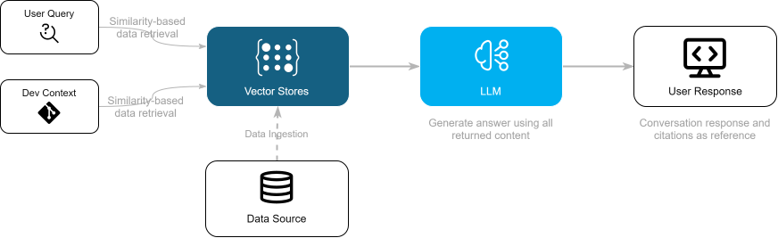

## (Code) Generation
Context of LLM prompt is limited and it is important to provide the right context to the model. Fore code suggestions, we should define what data should we include in the prompt, how to rank its relevancy. In common development experience we can define the following data sources that can be used to define the context

### Operational Context
  - current file, language, project, folder
  - state of repository, i.e. modified files, git diff, branch, etc.
  - current cursor position, i.e. function, class, variable, whether completion is multi- or singleline, should we consider FIM (fill-in-the-middle) etc.
  - current selection, i.e. selected text, line, block, etc.
  - current cursor surroundings, i.e. previous and next lines (contextual comments can be important for search purposes), etc.
  - state of editor, i.e. open files, tabs, recent edits, clipboard content etc.
  - Abstract Syntax Tree (AST) for current file

### Environment Context
  - files in repository, preferrably related to current context
  - external repositories, i.e. dependencies, libraries, etc.
  - AST for current context, i.e. current file, related files, current solution, project, etc.
  - code guidelines and practices for current context (language, project, team), i.e. code style, libraries, etc.
  - code analysis configuration, i.e. linters, static analyzers, formatters, etc.
  - documentation for current context, i.e. external (web) or internal documentation and resources, etc.

### Task Context
  - data for current task in task management system, i.e. task description, NFRs, etc.
  - data in repository for current task or related tasks, i.e. comments, PRs, etc.
  - data in external repositories for current task or related tasks

### User Context
  - user style, preferred libraries, etc.
  - files edited by user in current and external repositories
  - user role, i.e. developer, tester, etc.

### Limitations
  - privacy and security concerns, i.e. should we include sensitive data in the prompt
  - current LLM and RAG settings, i.e. model limits, api capabilities, parameters like temperature, etc.
  - performance, i.e. how whole system is able to handle the context

## Existing Solutions
AI Assistance tools and code generation products are promising to improve the development experience. Some of the most popular tools are

### Github Copilot
Github Copilot is most popular AI assistant for code generation. It supports most of the popular IDEs and code editors and provides following features

  - **Code Assistant** - provides code suggestions, chat with code gen capabilities, doc generations and more
  - **Repository indexing** - GitHub allows to index the repositories and provide the better context for the code generation
  - **Fine Tuning** - allows to fine tune the model for specific tasks and code generation
  - **Knowledge bases** - you can fine-tune Copilot code completion by creating a custom model based on code in your organization's repositories
  - **Copilot Workspace** - task-oriented development environment, instead of making suggestions as you type, it helps you plan and author a coordinated set of changes, so that you can steer the system via natural language

### Cursor
Cursor is a code editor built for programming with AI. It is run on VSCode wngine but no offered as a plugin. It provides following features

  - **Code Assistant** - includes a powerful autocomplete that predicts thr next edit, can suggest multiple edits at once
  - **Chat** - allwos to use *codebase*, *libraries*, *documentation* and *images* to find relevant code or answer to the query
  - **Cursor Prediction** - Cursor allows to index the repositories and provide the better context for the code generation
  - **Customization** - allows to select LLM model for the code assistance

### Continue.Dev
The leading open-source AI code assistant, it provides highly customizable environment, offered as plugin for VScode and JetBrains IDE with following features

  - **Code Assistant** - provides code suggestions, chat with code gen capabilities, AI code edit capabilities
  - **Custom models** - allows to set up custom models for different features with simple configuration
  - **Custom Context** - allows to augment the context with custom data sources, codebase, web resources, IDE state, Issue tracking services, Code search, etc. (https://docs.continue.dev/customize/context-providers)

## AI Dev Tools
In order to model, evaluate, build and run Code Generation and Context Augmentation workloads we can use tools provided by the following vendors

### LLamaIndex
LlamaIndex is a framework for building context-augmented generative AI applications with LLMs including agents and workflows. It provides **Python** libraries, tools and APIs for buiding data-backed LLM applications

https://docs.llamaindex.ai/en/stable/getting_started/concepts/

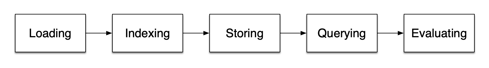

### LangChain
LangChain is a platform for building AI-powered applications with LLMs. It provides flexible API and toolkit that contains **Python** and **JavaScript** libraries for building AI applications and contains complete set of RAG building blocks

https://python.langchain.com/docs/concepts

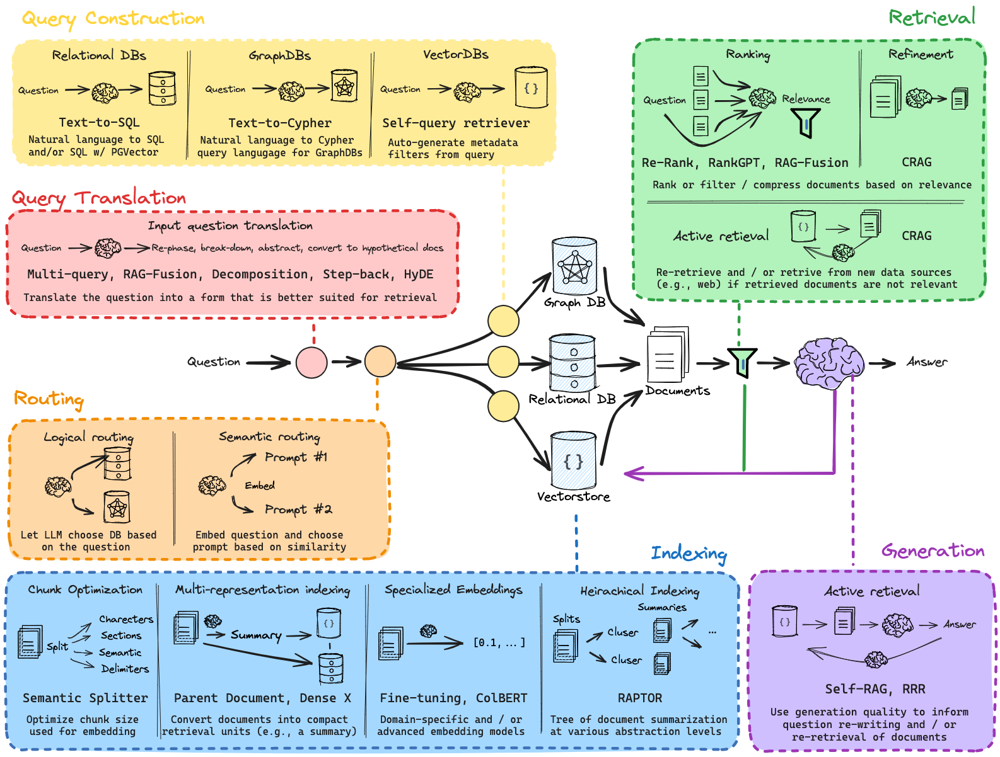

To learn now to use langchain APIs, for which tasks and workloads you can check chat, specifically design for the purpose https://chat.langchain.com/ 

### Semantic Kernel
Semantic Kernel is a lightweight, open-source development kit that lets you easily build AI agents and integrate the latest AI models into your **C#**, **Python**, or **Java** codebase

https://learn.microsoft.com/en-us/semantic-kernel/concepts/kernel

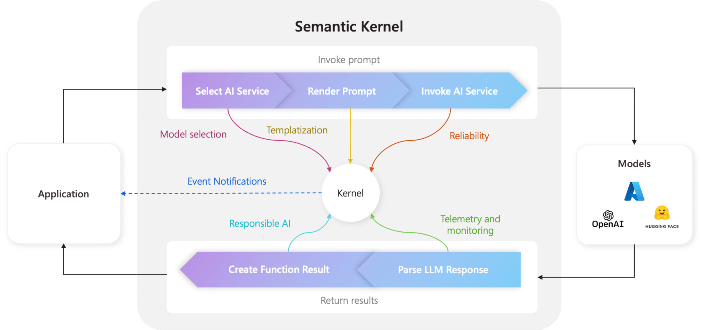

## Data Ingestion
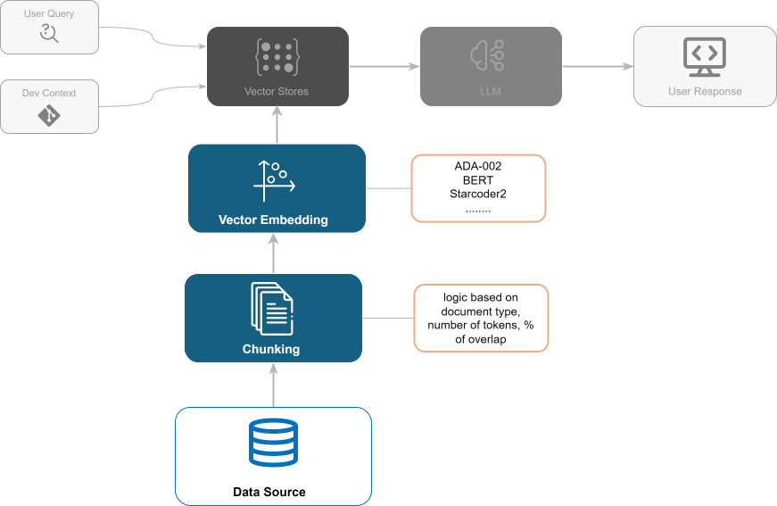

### Loading documents

Document is piece of information available for indexing. It can be a text, image, video, audio, etc. Document effectively consists of two parts: *content* and *metadata*. Metadata is a set of key-value pairs that describe the content.

In order to load document to vector store, it should fit the size for similarity search in a way that it contain meaningful information (that is highly dependent on the document nature) and resonable size. Too fine-grained might lead to noisy retrieval, and too coarse might limit usefulness.

### Chunking

Chunk is the unit of storage that will be retreived fron Vecrtor Store. It will have it's embedding vector and metadata of the whole document, it solves 3 problems 

 - Splitting long documents into limited-length passages allows multiple retrieved documents to be passed to the LLM within its context window limit.
 - Chunking provides a mechanism for the most relevant passages of a given document to be ranked first.
 - Vector search has a per-model limit to how much content can be embedded into each vector.

Chunking Strategies 
  - **Fixed Size** - evaluate the best token length, i.e. 512 tokens, 1024 tokens, etc. up to the model embedding limit
  - **Overlapping** - allows to include the same information in multiple chunks, i.e. 10% overlaping between chunks
  - **Interquartile** - split documents into chunks based on the interquartile range (e.g., lower 25%, middle 50%, upper 25%)
  - **Document Based** - split by meaningful parts based on document nature
      - Split code by functions, classes, etc.;and text by paragraphs, sentences, etc.
      - Split Markdown by headers, lists, etc.
      - Keep tables within the same chunk
      - Preserve sentence or paragraph boundaries
  - **Semantic** - group the content by semantic meaning, i.e. split by topics, entities, etc.

## Embeddings
Embeddings are effectively representations of the data in a high-dimensional vector space. In Transformer-based models embedding vectors are representing semantical meaning of certain chunk of data. Base unit of data (text) representation is a token, the building block of the text, say a word or a subword and depends on the tokenization strategy for certain model.

To be able to process inputs, models feature vocabulary, that is a set of tokens that model can understand, represented by their embedding vectors and are learned during the training process. One of main metrics of embedding models are
 - *dimension size* - typical models have around 768 and 2K, larger and more specialized models can go up to 4K or beyond
 - *vocabulary size* - standard vocabulary sizes for monolingual models are around 30K-60K, multilingual models can go up to 250K
 - *context window* - standard models handle ~4K tokens, advanced models can handle up to 128K tokens, and the latest cutting-edge models can go up to 1 million tokens

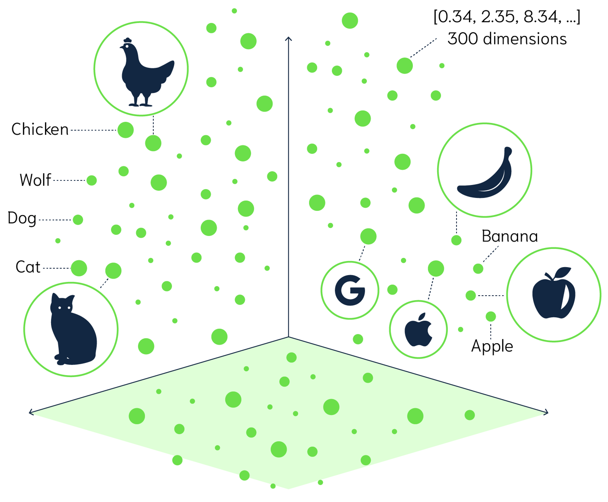

While using vocabularies we can measure relatedness of the tokens, model are also capable of generating embeddings for the whole text (say, set of tokens) by using several strategies, that  that is supposed to reflect the meaning of the entire sequence. Most common pooling strategies are `Mean Pooling` (element-wise arithmetic mean of the token-level embeddings), `Max Pooling` (element-wise max of the token-level embeddings), `CLS Token Pooling` (use the embedding of the [CLS] token and typically used for classification tasks)

<table>
<tr>
  <td>

  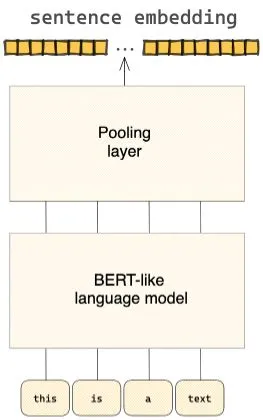

  </td>
  <td>

  | **Token**  | **Embedding (3 dimensions)**  |
  |------------|-------------------------------|
  | "The"      | [0.1, 0.2, 0.5]               |
  | "cat"      | [0.6, 0.4, 0.3]               |
  | "sat"      | [0.3, 0.8, 0.7]               |
  | "on"       | [0.2, 0.3, 0.6]               |
  | "the"      | [0.5, 0.4, 0.2]               |
  | "mat"      | [0.7, 0.9, 0.1]               |
  | **Mean**   | **[0.4, 0.5, 0.4]**           |
  | **Max**    | **[0.7, 0.9, 0.7]**           |

  </td>
</tr>
</table>

Another approach is `self-attention`, which goal is to update the vector for every token in the input in relation to the others, so that all embeddings better capture the context, for example apply *Positional Encoding*. This *Attention Pooling* technique mostly used in fine-tuned models for specific tasks as it requires more processing workloads.


<table>
<tr>
  <td>

  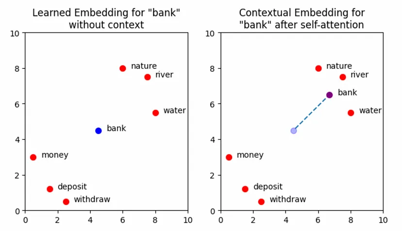
  </td>
  <td>

| **Token**  | **Token Embedding (4 dimensions)** | **Positional Encoding (4 dimensions)** | **Final Embedding (Token Embedding + Positional Encoding)** |
|------------|-------------------------------------|----------------------------------------|--------------------------------------------------------------|
| "The"      | [0.1, 0.2, 0.3, 0.4]               | [0.00, 0.00, 1.00, 1.00]              | [0.10, 0.20, 1.30, 1.40]                                      |
| "cat"      | [0.5, 0.6, 0.7, 0.8]               | [0.84, 0.54, 0.54, 0.84]              | [1.34, 1.14, 1.24, 1.64]                                      |
| "sat"      | [0.9, 1.0, 1.1, 1.2]               | [0.90, 0.43, 0.43, 0.90]              | [1.80, 1.43, 1.53, 2.10]                                      |
| "on"       | [0.2, 0.3, 0.4, 0.5]               | [0.14, 0.98, 0.98, 0.14]              | [0.34, 1.28, 1.38, 0.64]                                      |
| "the"      | [0.6, 0.7, 0.8, 0.9]               | [0.79, 0.59, 0.59, 0.79]              | [1.39, 1.29, 1.39, 1.69]                                      |
| "mat"      | [0.3, 0.4, 0.5, 0.6]               | [0.87, 0.49, 0.49, 0.87]              | [1.17, 0.89, 0.99, 1.47]                                      |


  </td>
</tr>
</table>

Embeddings are crucial part of Transformer models, and while LLMs are also capable of generationg embeddings, they are not always the best choice for the task. Embeddings that are produced by Embedding models measure the relatedness of text strings and capture their contextual meaning, thus they are commonly used for:

  - Search (where results are ranked by similarity to a query string)
  - Clustering (where text strings are grouped by similarity)
  - Recommendations (where items with related text strings are recommended)
  - Anomaly detection (where outliers with little relatedness are identified)
  - Diversity measurement (where similarity distributions are analyzed)
  - Classification (where text strings are classified by their most similar label)

LLM vendors provide a variaty of embedding models for different purposes that differ in vector dimension size and context window size. Some models are sprecifically designed for embeddings, some of them provide embeddings along with generation capabilities. Here are some of the most popular models

  - **OpenAI** - 2nd and 3rd generation models to be used for search, clustering, etc. (https://platform.openai.com/docs/guides/embeddings/embedding-models). Provided via API
  - **Sentence Transformers (a.k.a SBERT)** - state-of-the-art text and image embedding models, applicable for a wide range of tasks, such as *semantic textual similarity*, semantic search, clustering, classification, paraphrase mining, and more with dimentionality up tp 4K (https://sbert.net/)
  - **Cohere** - provides separate embedding model for english and multilingual text via API, that also features *embeddings purpose* parameter for embedding endpoints and has *Classification* endpoint that allows to classify the text based on examples given (https://docs.cohere.com/docs/models#embed)
  - **Llama Family** - state-of-the-art generic purpose model from Meta available in various parameter sizes (https://www.llama.com/)
  - **Voyage AI** (Anthropic) - embedding model that is offered by *Anthropic*, provides state-of-the-art embedding models and offers customized models for specific industry domains such as finance(`voyage-finance-2`), law (`voyage-law-2`), healthcare and code (`voyage-code-2`). Its family has models with up to 1536 dimensions and 16K context size with purpose of text and code retreival (https://docs.anthropic.com/en/docs/build-with-claude/embeddings)
  - **Gemini** - provides embeddings models (`text-embedding-004`) for words, phrases, and sentences(https://ai.google.dev/gemini-api/docs/embeddings)

While *OpenAI*, *Cohere*, *Voyage AI*, *Gemini* and some other vendors provide embeddings via inference API, there are also open-source projects that allow to run inference on your local machine or in the cloud
  - **Ollama** - is an open-source project that serves a for running LLMs on your local machine and provides possibility to pull a variaty of models (https://ollama.com/library)
  - **Hugging Face** - provides a wide range of open source models, including embeddings models (https://huggingface.co/models) that can be run via inference API with help of HF libraries
  - **Github Models** - provides a wide range of machine learning models (https://github.com/marketplace/models) that can be used via playground in the browser or run within [VSCode AI Toolkit](https://github.com/microsoft/vscode-ai-toolkit) Extension or CLI

### Advanced Indexing Strategies 

<br>

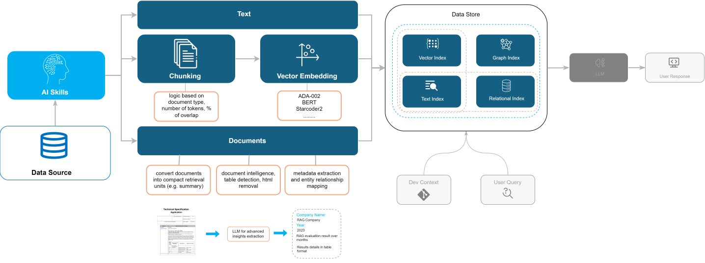

<br>

In order to improve quality of the search results, we can use advanced indexing strategies that will allow to provide more relevant data in a more reliable way.

  - Text Indexing - create text indexes to improve relevance of results by utilizing keyword search
  - Multi-Representation indexing - convert documents into compact retreival units 
  (e.g. summarize large text, table data, image descriptions provided by LLM) to embed into vector index while keeping reference to raw data
  - Multi-Model indexing - use multiple models to index the data, i.e. use SBERT for text, Codellama for code, etc.
  - Metadata Extraction - extract metadata from the documents and use it for filtering and ranking
  - Keyword Extraction - extract keywords from the query and use them for keyword search
  - Named Entity Recognition - extract named entities from the documents and set up relations between them for better understanding of data
  - Document Intelligence - preprocess data with AI (e.g. table detection, html removal, etc.)
  - Knowledge Graph - create a knowledge graph from the documents and use it for better understanding of the data  

## Data Retrieval
<br>

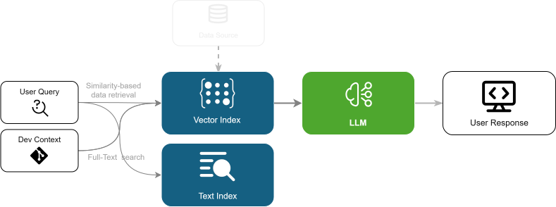
<br>

### Vector Search
The task of a vector search is to identify and retrieve a list of vectors (embeddings) that are closest to the given vector (embedding of your query), using a distance metric and a search algorithm. The *distance* between two vectors measures their relatedness. Small distances suggest high relatedness and large distances suggest low relatedness.

**Symmetric vs Asymmetric Search**<br>
For **symmetric semantic search** your query and the entries in your corpus are of about the same length and have the same amount of content. An example would be searching for similar questions.
For **asymmetric semantic search**, you usually have a short query (like a question or some keywords) and you want to find a longer paragraph answering the query.

It is critical that you choose the right model for your type of task.

**Search Algorithms**<br>
Despite of the model used, there are several search algorithms that differ in performance, precision and other properties.

*k-Nearest Neighbors*<br>
This brute force algorithm that is comparing every data vector in the database to the query vector. It is the most precise but also the most computationally expensive.

*Approximate Nearest Neighbors*<br>
This algorithm is using inner structures (**trees**, **graphs**, **clustering**, **hashing**, **compressed vectors**) to reduce the number of comparisons. It is less precise but much faster than k-NN. However, the results are not necessarily exact, it is possible that some vectors with high similarity will be missed. Here is example of how data can be partitioned for faster search.

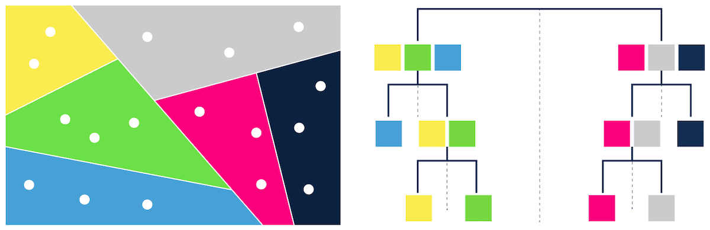

For all ANN methods, there are usually one or more parameters to tune that determine the recall-speed trade-off. If you want the highest speed, you have a high chance of missing hits. If you want high recall, the search speed decreases. For example for **HNSW** (Hierarchical Navigable Small World) they are  *efSearch* (the number of neighbors to search for) and M (the number of edges to add to every new node during insertion). 

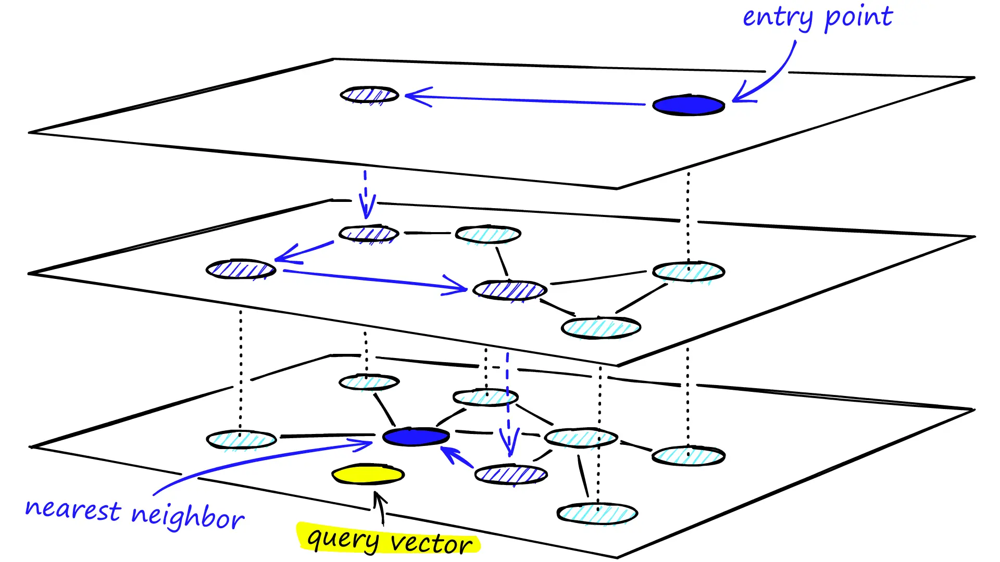

*SVM (Support Vector Machine)*<br>
This supervised algorithm is used for classification, regression and outliers detectiontasks, but it can also be used for similarity search. It is not as common as k-NN or ANN, but it can be useful in some cases.

--- 

Depending on the model used, vectors can have thousands of dimensions, some similarity measures are more compute-heavy than others. For that reason, we have different distance metrics that balance the speed and accuracy of calculating distances between vectors.

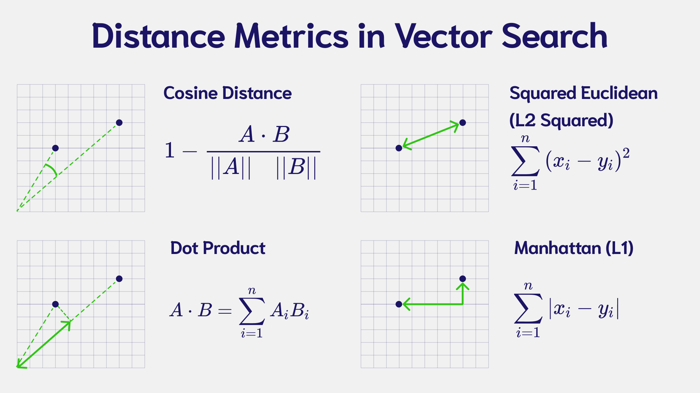

  - **Cosine Similarity** - measures the angle between two vectors, the cosine distance is `1 - Cosine Similarity`, a distance of 0 indicates that the vectors are identical, whereas a distance of 2 represents opposite vectors (it is mostly used in text search)
  - **Dot Product** - dot product takes two or more vectors and multiplies them together, it is negative if the vectors are oriented in different directions and positive if the vectors are oriented in the same direction.
  - **Squared Euclidean** - measures the straight-line distance between two vectors. If the distance is zero, the vectors are identical, the larger the distance, the farther apart the vectors are.
  - **Manhattan** - measure is calculated by summing the absolute distance between the components of the two vectors

### Full-Text Search
Despite of vector search based on embeddings is providing quite accurate results, for some queries and contexts full-text keyword search can bring better performance and significantly contributes to contextual understanding.

Full-Text (lexical) search generic concept is to tokenize the corpus and the query, then search for the tokens in corpus. The search can be done using different algorithms and data structures, some of the most popular are

  - **TF-IDF (Term Frequency-Inverse Document Frequency)** - is a statistical measure that evaluates how important a word is to the corpus. It can also be used to rank the relevance of documents, recieved in RAG workflow, to a query.
  - **BM25 (Best Matching 25)** - is a ranking function used by search engines to rank the relevance of documents to a query. It is an improvement over TF-IDF and is used in search engines like ElasticSearch and Solr.
  - **Inverted Index** - is a data structure that maps content to its location in a document. It is used to optimize full-text search, where the search term is matched against the index instead of the whole corpus. It is used in most search engines, including ElasticSearch, Solr, and others.

To effectively use full-text search capabilities you can consider some popular search engines and services like **ElasticSearch** and **Solr** along with cloud-based services like **Algolia**, **Azure AI Search**, **AWS CloudSearch**, and **Google Cloud Search**.

### Hybrid Search
The approach that combines both vector search and full-text search usually referenced as **Hybrid Search** and allows to leverage the power of both approaches.
| Feature                    | Full-text search | Pure Vector search | Hybrid search |
|----------------------------|------------------|--------------------|---------------|
| Exact keyword match         | ✅                | ❌                  | ✅             |
| Proximity search            | ✅                | ❌                  | ✅             |
| Term weighting              | ✅                | ❌                  | ✅             |
| Semantic similarity search  | ❌                | ✅                  | ✅             |
| Multi-modal search          | ❌                | ✅                  | ✅             |
| Multi-lingual search        | 🟡                | ✅                  | ✅             |

- **✅** feature is supported.
- **❌** feature is not supported.
- **🟡** partial or limited support (in the case of multi-lingual search for full-text search).

<br>

### Advanced Search Strategies

<br>

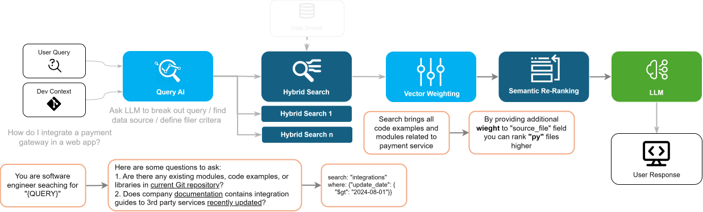

<br>

**Metadata Filtering**<br>
Filtering can bring significant improvement to the search results. It can be done in the context of the query, where you can filter the documents based on the metadata provided in the vector store. With this approach you can narrow down the documents that are more relevant to the query and improve performance of the search.

**Query Analysis and Self-Querying**<br>
The filter for documets metadata can be defined based on the context and can involve LLM capabilities to specify certain fields or values that should be present in the document.

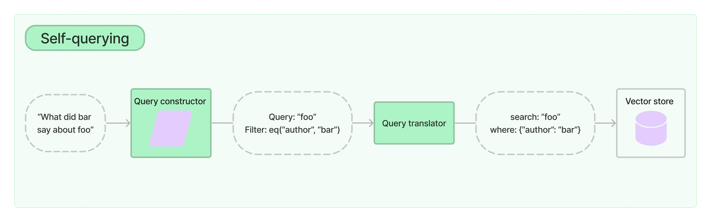

**Source Routing**<br>
Based of the contextual knowlegde, you can route the query to the specific vector store or search engine that is most relevant to the query. For these purposes you can use heuristics, strict logic models or even LLM.

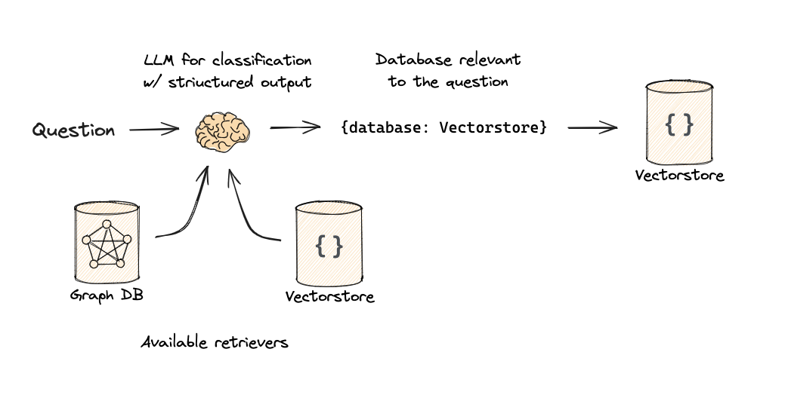

**Prompt Routing**<br>
Prompt structure can be very dependent on query context and on query itself. You can leverage search or LLM capabilities to select most relevant prompt or/and route the prompt to the specific LLM model.

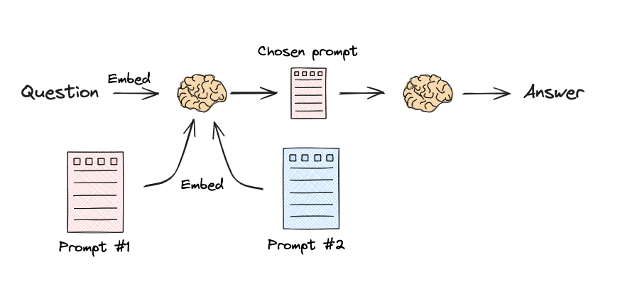

**Query Reformulation**<br>
User queries are not always perfect, futhermore, they are not aware of your dat structure and the content available. You can use LLM capabilities to reformulate the query to use different sources or to provide more relevant results.

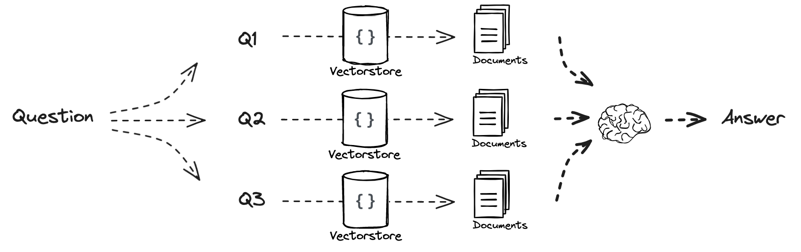

**Re-Ranking and Fusion**<br>
When multiple sources are used for data retrieval, it is important to re-rank the results to provide the most relevant data to the user. Re-ranking can be done based on the following strategies

  - **Vector weighting** - when reranking results, we can set the importance of each resultset by setting the weight multiplier for each searh  score.
  - **MMR (Maximum marginal relevance)** - is a re-ranking algorithm that aims to reduce redundancy in search results by selecting the most relevant and diverse documents.
  - **RRF (Relevance Ranking Fusion)** - the algorithm that allows to assign a reciprocal rank score to each document received in search results from multiple methods. It combines the scores to create a new ranking. The concept is that documents appearing in the top positions across multiple search methods are likely to be more relevant and should be ranked higher in the combined result.
  - **Semantic Re-Ranking** - is a re-ranking algorithm that uses semantic similarity to update relevance score of search results.
    - **Cross-Encoding (x-enc)** - cross-encoder concatenates text pairs (query and doc) into a single sequence (e.g., [CLS] Text1 [SEP] Text2 [SEP]) and fed into the transformer model, the model processes the entire concatenated sequence and produces a single output (usually from the [CLS] token or a classification head), which represents the similarity or relevance between texts ([example](https://cookbook.openai.com/examples/search_reranking_with_cross-encoders)).
    - **ColBERT (Contextualized Late Interaction over BERT)** - uses a late interaction mechanism, where the token-level embeddings of queries and documents are computed separately. These embeddings are then compared using a MaxSim operation during retrieval, which takes the maximum similarity between each query token and all document tokens.
    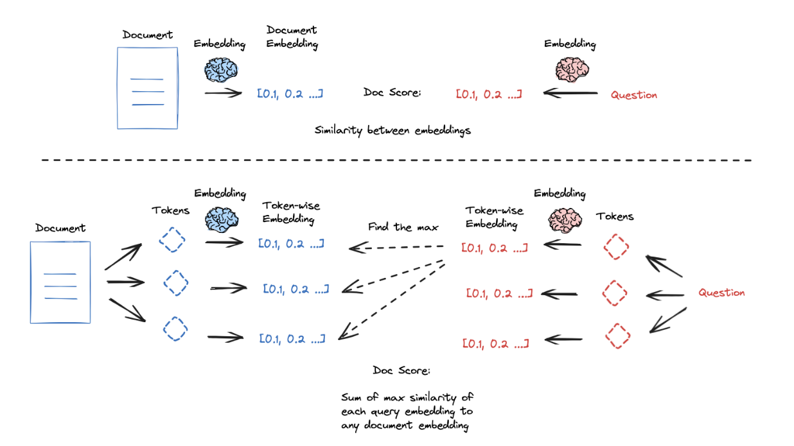
    - **Cohere** and **Voyage AI** - is a re-ranking API services that allows to re-rank documents with help of specifically trained `rerank-*` models (https://docs.cohere.com/docs/rerank-2, https://docs.voyageai.com/docs/reranker)

The final flow of data retrieval that will significantly improve the quality of the search results and context understanding is shown below (based on the example of the [Azure AI Search](https://learn.microsoft.com/en-us/azure/search/hybrid-search-ranking) service).

<p align="center">
  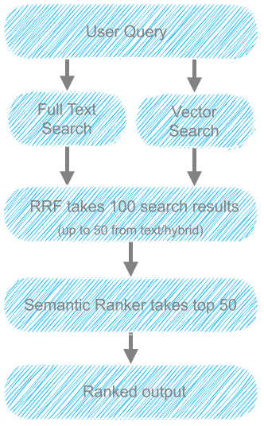
</p>

### Vector Stores
https://docs.llamaindex.ai/en/stable/module_guides/storing/vector_stores/
https://python.langchain.com/docs/integrations/vectorstores/

Vectore store capabilities
  - Storage type (in-memory, self-hosted, cloud)
  - Filtering (stores can support metadaa filtering)
  - Vector Similarity search
  - Text search
  - Hybrid search
  - Vector Store specific search

Some common vector stores
  - Faiss (Facebook AI Similarity Search)
  - Pinecone
  - ElasticSearch
  - pgvector (Postgres)
  - Altas Search (MongoDB)
  - Azure AI Search / NoSQL DB (with semantic reranking)
  - Qdrant
  - Chroma


## LLMs

### Proprietary API
  - OpenAI (GPT-*)
  - Anthropic (Claude)
  - Google (Gemini)
  - Cohere

### Inference API
  - Hugging Face
  - Cloud services (Azure Open AI, Amazon Bedrock)

### Local
  - Ollama
  - LlamaCpp (CPU optimized)

### Special purpose
  - **Starcoder** - Model is intended for code completion, they are not instruction models, commands like "Write a function that computes the square root." do not work well. Model natively supports Fill-in-the-middle prompts and can be fine-tuned for specific tasks (https://huggingface.co/bigcode/starcoder)
  - **Stability AI** - (https://huggingface.co/stabilityai/stable-code-3b)

### Context window, parameters and performance
Another important aspect of LLMs is the context window and the number of parameters. The more parameters the model has, the more information it can store and process, thus driving multi-language and multi-modal capabilities. 

The context window is the number of tokens the model can accept at once. The larger the context window, the more information the model can use to generate the output.

However, the more parameters and context model has, the more computationally expensive it is to run, and the more memory and costs it requires. For performance-critical applications, it is important to balance the model capabilities with the available resources and cost.

  - **OpenAI** - A family of GPT models, featuring high-intelligence real time processing `GPT-4o` and `OpenAi o1` "thinking" model, providing context length up to 128K and offered via API and services
  - **Claude** - Family of models from Anthropic, with multi midal and multi language capabilities with defferent offerings for speed and performance
  - **Gemini** - Natively multimodal LLM family, with an updated long context window of up to two million tokens and provided via API
  - **Llama 3.\*** - Leading in open-source LLMs, available in sizes from 1B up to 405B (3.2),  (https://www.llama.com/), available to download and run on-premises
  - **Codellama** - LLM that can use text prompts to generate and discuss code (https://ollama.com/library/codellama)
  - **Starcoder** - 15.5B parameter models trained on 80+ programming languages and  GitHub code, it features upto 6K dimension size and a context window of up to 16K tokens
  - **Stability.ai** - provides a wide range of models for different purposes, i.e. code generation (*Stable Code*), text generation, etc. (https://stability.ai/stable-lm)

### Prompts and Features
LLMs can have different approaches of how to construct the promps, most of them however are based on the role models with chat experience. Unlike structures language, prompts cannot guarantee stable output, but it is possible do make it more consistent by using vendor recommendations and capabilities, for example

  - **Structured Output** - Feature provided by OpenAI API, designed to ensure model-generated outputs will exactly match JSON Schemas provided by developers.
  - **Tool Calling** - Open AI API feature, allowing developers to describe functions to gptmodels, and have the model intelligently choose to output a JSON object containing arguments to call those functions.
  - **Fill-in-the-middle** - Feature provided by Starcoder and others, allowing to provide a partial code snippet and have the model complete it.

For general purpose models we can follow some common suggestions:
  - Be specific (dierectly specify the language, purpose, context, desired output)
  - Use examples (provide examples of the code suggestions, the data)
  - Use structured output if needed and possible
  - Provide system instructions if possible, use role-based prompts

## Evaluation
The evaluation of the RAG system is crucial to understand the quality of the results and to improve the system. The evaluation can be done on different levels, and for any of them we can appy commonly used metrics.

  - **Precision** - focuses on how correct the positive predictions were.
  $$
  \text{Precision} = \frac{\text{True Positives}}{\text{True Positives} + \text{False Positives}}
  $$


  - **Recall**  - focuses on how many actual positives were captured.
  $$
  \text{Recall} = \frac{\text{True Positives}}{\text{True Positives} + \text{False Negatives}}
  $$


  - **Accuracy** - looks at the overall correctness of both positive and negative predictions.
  $$
  \text{Accuracy} = \frac{\text{True Positives} + \text{True Negatives}}{\text{Total Predictions}}
  $$

But as long as tasks in RAG has different nature, some specific metrics can be used to evaluate the quality of results.

**Generation**<br>
  - `Faithfulness` - measures the factual consistency of the generated answer against the given context. It is calculated from answer and retrieved context
    $$
    \text{Faithfulness} = \frac{\text{Number of claims in generated answer that can be inferred from given context}}{\text{Total number of claims in generated answer}}
    $$
  - `Response Relevancy` - focuses on assessing how pertinent the generated answer is to the given prompt, for example

    > Question: *Where is France and what is it's capital?*
    > Low relevance answer: *France is in western Europe.*
    > High relevance answer: *France is in western Europe and Paris is its capital.*

  - `Sensibleness` - measure of how *logical*, *coherent*, and *reasonable* the responses generated by a model are, based on the input provided.
    - Coherence example
      > Input: *"What is the capital of France?"*
      > Sensible Response: *"The capital of France is Paris."*
      > Non-Sensible Response: *"France is a type of food."*
    - Relevance example
      > Input: *"Tell me about machine learning."*
      > Sensible Response: *"Machine learning is a field of artificial intelligence focused on building systems that can learn from data."*
      > Non-Sensible Response: *"Machine learning is fun to play with cats."*
    - Contradiction example
      > Input: *"Is water wet?"*
      > Sensible Response: *"Water is considered wet because it can make things damp."*
      > Non-Sensible Response: *"Water is dry because it flows easily."*

**Retrieval**<br>
  - `Context Precision` - measures the proportion of relevant chunks, calculated as the mean of the `precision@k` for each chunk in the context.
  - `Context Recall` - measures how many of the relevant documents (or pieces of information) were successfully retrieved.
  - `Normalized Discounted Cumulative Gain (NDCG)` -  common information retrieval metric that provides a score between 0 and 100 based on how well a retrieval system (1) found the best results and (2) put those results in the ideal order
 
 **Indexing**<br>
  Most impactful measure for indesing is how correct vectors are calculated with respect of latency and search results, so core questinos is when do ANN Accuracy errors (ANN algorithms trade off accuracy and speed) affect Information Retrieval errors?

For evaulation of RAG systems we can use some of the most popular tools and frameworks, for example
  - **Ragas** - toolkit for evaluating and optimizing Large Language Model (LLM) applications, features *Objective Metrics* evaluation *Test data generation*, etc. (https://ragas.io/)
  - **Langchain** - provides a set of tools for evaluation and offers `LangSmith` platform. Also has some convenient tools like https://autoevaluator.langchain.com/
  - **Open AI** - provides a set of tools for evaluation of the models, including *Dataset Generation*, *Eels definition an run*, etc. (https://platform.openai.com/docs/guides/evals)
  - **RaLLe** - accessible framework for developing and evaluating retrieval-augmented large language models(https://github.com/yhoshi3/RaLLe)
  - **ARES** - Automated Evaluation Framework for Retrieval-Augmented Generation Systems (https://github.com/stanford-futuredata/ARES)

### Evaluation process
https://huggingface.co/learn/cookbook/rag_evaluation

https://m365playground.prod.substrateai.microsoft.net/eval 

https://seval.microsoft.com/ 


## Graph RAG
https://microsoft.github.io/graphrag/ 

## Responsible AI
https://learningpath.microsoft.com/7306

## Explore Python Workbook

```
pip install -r requirements.txt
```